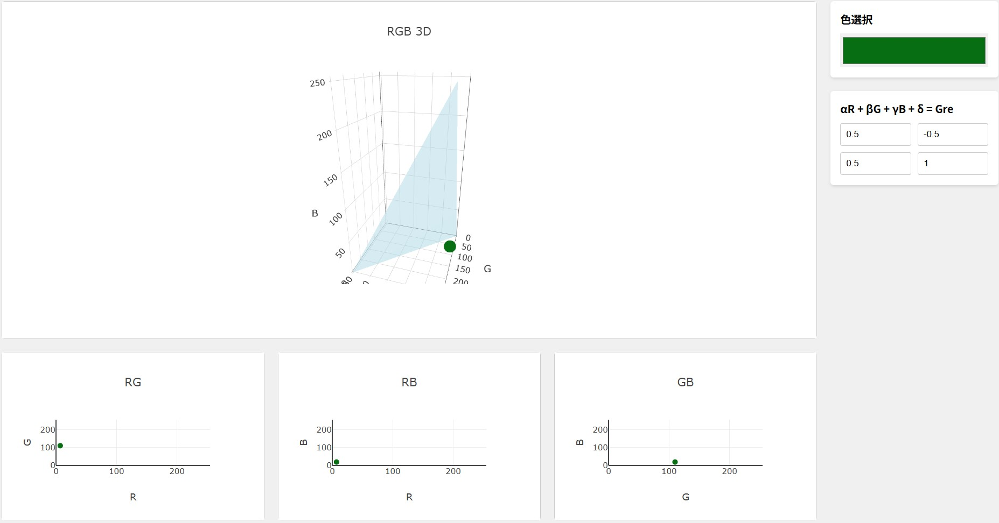

# CIVE_viewer
RGB空間を切断する平面と色を確認するためのものです．  
以下に動機や目的などをまとめました．  
https://zenn.dev/xiakou/articles/cive-viewer-js  



##　ローカル実行
index.htmlがあるディレクトリにおいて以下をターミナルで実行してください．
簡易的な確認であればindex.htmlをブラウザで開くだけでも大丈夫です．
```
$ python3 -m http.server 8000
```